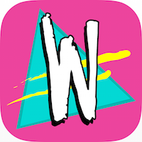

[](https://travis-ci.com/futurice/wappuapp-client)

# Whappu app



> An event app similar to a festival app, which helps students of TTY(Tampere University of Technology) to find events and celebrate between 19th April - 1st May.

Short facts:

* React Native + Redux
* iOS and Android
* Developed in very short time(=expect some code quality issues)

## Release

### iOS

* Make sure you have latest App Store provisioning profile installed
* Package production script bundle with `npm run release:ios`
* In XCode project settings, bump Version field
* Choose `Generic iOS Device` (or a connected iPhone) as build target
* Run `Product > Clean` (for paranoia) and `Product > Archive`
* Go to `Window > Organizer`, select latest build with correct version and press Upload to App Store

### Android

* Setup Android environment: https://facebook.github.io/react-native/docs/android-setup.html#content
* Copy `whappu-release.keystore` under `android/app` if it's not there already.
* Bump `versionCode` and `versionName` in `android/app/build.gradle`
* `cd android && ./gradlew assembleRelease --no-daemon`
* Built .apk is saved to `android/app/build/outputs/apk`

## Local development

**BEFORE JUMPING TO IOS OR ANDROID GUIDE, FOLLOW THESE GUIDES:**

* https://facebook.github.io/react-native/docs/getting-started.html
* (Optional) https://facebook.github.io/react-native/docs/debugging.html#content
* `npm install` (you might need to use npm@2 version)
* `npm dedupe` (maybe necessary if you encounter Namespace collision error)
* `cp env.example.js env.js` and fill in the blank secrets in the file

### iOS

The xcode-project is expecting that you have nvm installed. It can be reconfigured in
`Build Phases > Bundle React Native code and images`.

- [Install Cocoapods](https://guides.cocoapods.org/using/getting-started.html#installation)
- `cd ios && pod install`
- `open wappuapp.xcworkspace`

  **Note:** Use the .xworkspace instead of .xcodeproj!

- Cmd + R

### Android

Running Android? Call Pasi


### Common problems

Try these:

* Google: e.g. `react native Naming collision detected` almost always provides
useful resources to fix problems
* Search [react-native issues](https://github.com/facebook/react-native)
* Search from the react native component's issues

#### Could not connect to development server

Make sure:

* React native packager is running (`npm start`)
* You have configured React native correctly: https://facebook.github.io/react-native/docs/getting-started.html
* Your mobile phone is connected to same wifi as your computer

#### Loading from <your-ip>:8081...

Stuck at the white screen? It may take even minutes to do the initial load..

#### Error: Naming collision detected

Try to run `npm dedupe`.


#### Can't find 'node' binary to build React Native bundle

At least `nvm` causes this. Change Build Phases -> Bundle React Native code and images to:

```
export NODE_BINARY=node
. ~/.nvm/nvm.sh  # add this
nvm use 4        # add this (or whatever node version you are using)
../node_modules/react-native/packager/react-native-xcode.sh
```

#### Websocket connection failed

Setup your IP address for debugging https://facebook.github.io/react-native/docs/debugging.html#content

#### jsSchedulingOverhead (-48ms) should be positive

Issue: https://github.com/facebook/react-native/issues/1598
Do this: https://github.com/facebook/react-native/issues/1598#issuecomment-172890857
